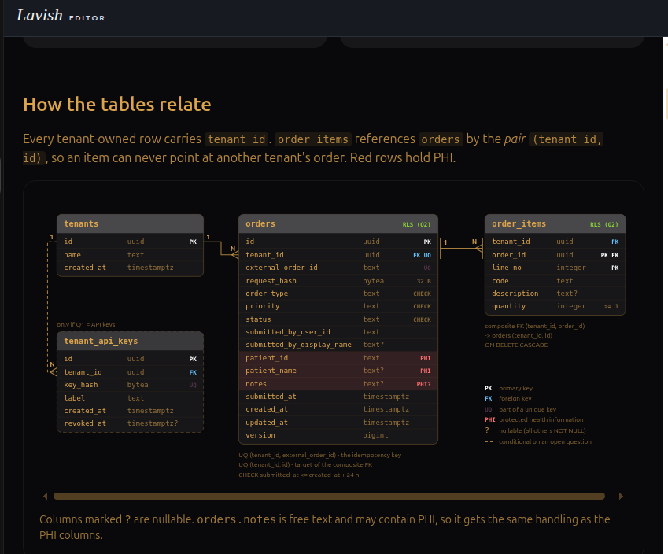

## Tooling
I use an open source agent distro - firstmate(https://github.com/kunchenguid/firstmate) - to manage my terminal based multi-agent development workflow. Besides coding, this tool also automate linting, documentation, validation and PR creation. It supports agentic development natively, so it also generates and maintains AGENTS.md.

## Prompt 1 — Build Spring Boot service skeleton with Gradle
**Asked:** "jacobian-hw project is a SprinBoot app provide REST endpoint for order intake
and query APIs. First step, create a starter application with Java 21, latest
stable springBoot 3.x release, and gradle.Manage dependency with version
catalog, manage java version using java toolChain. Add lint to the build steps."

**Got:** https://github.com/suqingbai/jacobian_hw/pull/1 

**Changed:** None

**Why:** 

## Prompt 2 — Add GitHub Action for CI
**Asked:** "add github action for CI, use direct PR mode"

**Got:** https://github.com/suqingbai/jacobian_hw/pull/2

**Changed:** None

**Why:** 

## Prompt 3 — Add persistent layer support: postgreSQL db, JPA, and flyWay
**Asked:** "pull in persistant layer support: postgreSQL db, JPA, and flyWay. For spring
dev profile, running postgreSQL(latest stable dev version) container locally,
bootstrap db container using spring support for docker to avoid seperate
startup. Test spring to db connection using "select * from dual" or something
similar."

**Got:** https://github.com/suqingbai/jacobian_hw/pull/3

**Changed:** None

**Why:** 

**Research:** 
1. confirmed upgrading spring boot managed flyway version to newer is logical
2. confirmed postgreSql test container lifecycle, one container per ./gradlew test run

## Prompt 4 — Claude proposal for db design
**Asked:** "Look the provided sample json request for the order creation endpoint and
suggest a RDBMS database schema. Open your suggestion in Lavish for review.
Don't create the schema for now. Here is the sample: [Pasted text #2 +23
lines]"

**Got:** 

**Changed:** 
1. drop tenant_api_key table, security is out of scope for now
2. change type of order_type column of orders from text to char(1), choose meaningful char as much as you can 
3. create patients table with id, first_name, last_name columns, and change patient of orders to reference patients table by id, drop patient_name column
4. drop version column of orders

**Why:**
1. Assumed submitting user belongs to external system, so it's info is saved as part of the order, doesn't break to its own table. If a user belongs to the ecosystem we built, then I would break it to its own table.
2. In healthcare application, patient is a core concept, so I break it into its own table. Order management system may or may not be the source of the truth for the patient info, depends on overall system architecture. If the patient(or partially) belongs to another bounded context viewed from the domain driven design perspective, it still makes sense to have separate patient table to hold data replicated from the other context and attributes uniquely belong to order management system. The goal is to avoid coupling with other service(for example, patient service)
3. tenant_id in order_items table theoretically can be derived from orders table, but it is safer to keep tenant id on multiple tables to allow data segregation in every possible access path.

## Prompt 5 — 8 rounds of discussion with Claude to refine database design
**Asked:** 8 rounds feedback to Claude are recorded in the following report.md generated by Claude

**Got:** : https://github.com/suqingbai/jacobian_hw/blob/main/docs/claude_reports/db-design-session-report.md

**Changed:** see the report 

**Why:** 
main motivations:
1. Independent order-service schema for future-proof service modularity.
2. Separate DB roles for Flyway, app, and admin users.
3. Enforce RLS via the database to segregate tenant data.
4. Referenced patient and tenant data instead of creating or updating it to align with real production scenarios.

## Prompt 6 — build api, database schema and migration scripts based on the final design
**Asked:** "add implementation per approved  "/jacobian-order-schema/
- report.md: final DDL, decisions, your feedback quoted word for word, and test evidence.
- schema-review.html"

**Got:** https://github.com/suqingbai/jacobian_hw/pull/4

**Changed:** None

**Why:**

## Prompt 7 — questioned keyset pagination implementation for simplify opportunity
**Asked:** "Check if the version of PostgreSQL we use support UUIDv7 natively. If yes,
UUIDv7 is naturally chronological ordered, when you implemented keyset pagination, 
do you still need to check submitted_at column? can you simplify the pagination? Don't make any change, just report back your analysis"

**Got:** Claude's implementation is correct. Submitted_at and created_at are two different clocks

**Changed:** None

**Why:**

## Prompt 8 — add OpenAPI doc and version the APIs
**Asked:** "two changes: 1. add version v1 to both supported endpoints. 2. add springdoc
and swagger annotation to the APIs"

**Got:** https://github.com/suqingbai/jacobian_hw/pull/5

**Changed:** None

**Why:**

## Prompt 9 — add jib to build docker image and update compose.yaml
**Asked:** "let me reset the goal: use jib to build docker image. update compose.yaml so
it will start both contains together, connect service container to dev db
container with patient and tenant data seeded. Docker token:
xxxxxxxxxxxxx(masked real token) . don't add image push to CI for now.
use default tag. my docker username is suebai"

**Got:** https://github.com/suqingbai/jacobian_hw/pull/6

**Changed:** None

**Why:**

## Prompt 10 — Publish the container image from CI on pushes to main
**Asked:** "I added github repo secret DOCKER_HUB_TOKEN, add image publish to CI"

**Got:** https://github.com/suqingbai/jacobian_hw/pull/7

**Changed:** None

**Why:**

## Prompt 10 — add "status" into request hash as part of logically same order
**Asked:** "add status into request hash as part of logically same order"

**Got:** https://github.com/suqingbai/jacobian_hw/pull/8

**Changed:** None

**Why:**

